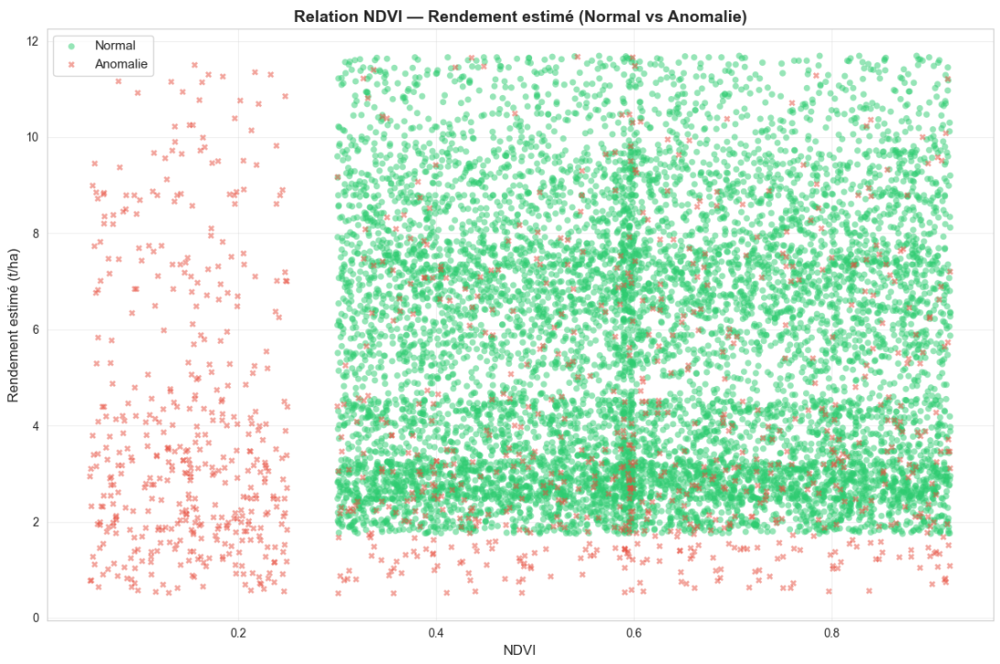
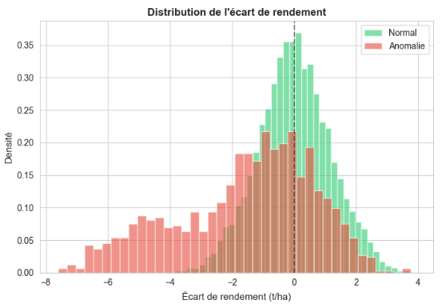
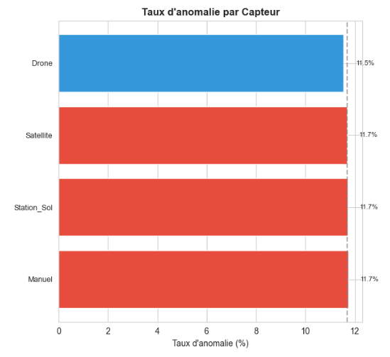

# 📓 Journal de bord — Détection d'anomalies parcellaires

**Projet :** Certification CISIA — Agriculture de précision
**Auteur :** Patrick LEVENEUR
**Date :** Juin 2026

---

Ce journal retrace le **raisonnement**, les **choix**, les **difficultés** et les **pistes abandonnées** tout au long du projet. Chaque décision est documentée avec le problème rencontré et la solution adoptée.

---

## 1. Reflexions sur le besoin

### Lecture de ce qui est demandé, et ce qu'il faut faire (mails, PDFs)
J'ai commencé par analylser ce qui est demandé afin de comprendre le besoin et ce qu'il faut produire.

### Consultation et analyse visuelle des données, et compréhension
Consultation primaire des données des fichiers CSV (observations.csv et parcelles.csv)
Constatation du fait que certaines données sont manquantes (exploitants, téléphones emails, NVDI, rendements etc...)
Constatation du fait que certaines données sont abhérentes (humidité > 100%, température abhérentes)

Cela signifie qu'il faudra trouver un moyen fonction des cas pour soit remplacer la donnée, soit supprimer la ligne complète.

### Recherche sur la signification de certains noms de colonne inconnues et spécifique au domaine agricole
**NDVI** : Le NDVI (pour Normalized Difference Vegetation Index, ou Indice de Végétation par Différence Normalisée) est un indicateur crucial en agriculture de précision. 
Il permet d'évaluer, de manière objective et quantifiable, la santé et la vigueur de la végétation sur une parcelle.
- Valeur est proche de 1 : Végétation très dense et en excellente santé.
- Entre 0,3 et 0,6 : Végétation modérée (cultures en croissance ou moins denses).
- Proche de 0	: Sol nu, roches, ou infrastructures.
- Négatif : Présence d'eau ou de neige.

### Hypothèses de départ

J'ai formulé trois hypothèses fondées sur ma compréhension du domaine agricole et des données annoncées.
L'analyse des données confirmeront ou pas ces hypothèse.

#### Hypothèse 1 : Le NDVI est le facteur le plus discriminant

**Hypothèse :** L'indice de végétation NDVI est l'indicateur principal d'une anomalie parcellaire. Une baisse anormale du NDVI (végétation stressée) devrait être fortement corrélée à `AnomalieLabel = 1`.

**Vérification :** Lors de l'EDA (Phase 2), j'ai comparé les distributions de NDVI entre Normal et Anomalie, puis tracé le nuage NDVI × Rendement pour visualiser les clusters.


**Conclusion :** L'image confirme donc que le NDVI est important. Plus le NDVI est inexistant, plus il y a d'anomalies, mais ce n'est pas général. Cela signifie que ça dépend aussi d'autre chose.

#### Hypothèse 2 : L'écart au rendement moyen est un signal fort

**Hypothèse :** Une parcelle dont le rendement estimé est significativement inférieur au rendement moyen de sa zone est probablement en anomalie.

**Vérification :** Création des variables `EcartRendement_t_ha` et `RatioRendement` en Phase 3, puis analyse de leur importance via SHAP. 


**Conclusion :** L'hypothèse n'est pas bonne. Une bonne partie confirme cette hypothèse mais une autre bonne partie ne le confirme pas.
Cela signifie que l'anomalie n'est pas forcément liée au rendement comparée au rendement moyen de la zone.

#### Hypothèse 3 : Le type de capteur influence la fiabilité des données

**Hypothèse :** Les capteurs n'ont pas tous la même fiabilité. Un relevé drone pourrait surestimer les anomalies par rapport à un satellite.

**Vérification :** Analyse du taux d'anomalie par type de capteur en Phase 2 (graphique en barres).


**Conclusion :** Une fois de plus, l'hypothèse était fausse.
On voit bien que les différents capteurs donnent sensiblement le même taux d'anomalie.


--- 


## Choix logiciels, outils et plan de développement

### Choix des outils vus en formation

La formation CISIA couvre deux stacks techniques distinctes :

- **FastIA (M1 à M6)** : orientée NLP et Transformers (Llama, spaCy, langdetect), avec une infrastructure MLOps déjà industrialisée (FastAPI, Docker, MLflow, CI/CD GitHub Actions, PSI Drift)
- **MaintenancePro (M7)** : orientée Machine Learning classique sur données tabulaires (scikit-learn, XGBoost, SMOTE, Optuna, SHAP)

Mon projet est sur des **données agricoles tabulaires** — pas de texte libre, pas de LLM. J'ai donc sélectionné les outils en fonction de leur adéquation au problème.

#### Outils réutilisés depuis la stack M7 (MaintenancePro)

| Outil | Pourquoi je le garde |
|-------|----------------------|
| **pandas + numpy** | Lecture, fusion, nettoyage et feature engineering — la base de tout projet tabulaire |
| **scikit-learn** | Pipelines (`ColumnTransformer` + `Pipeline`), encodage (OneHot + Ordinal), split train/test, métriques (ROC, F1, Recall) |
| **XGBoost** | Meilleur modèle du benchmark M7. Gère nativement les NaN, `scale_pos_weight` pour le déséquilibre, rapide sur 10 000 lignes |
| **imbalanced-learn (SMOTE)** | Données déséquilibrées (~15 % d'anomalies) → suréchantillonnage synthétique plutôt que simple pondération |
| **Optuna** | Optimisation bayésienne des hyperparamètres (TPE sampler), déjà intégré avec MLflow dans le projet M7 |
| **SHAP** | Explicabilité indispensable pour une coopérative agricole : pourquoi cette parcelle est-elle signalée comme anormale ? |
| **MLflow** | Tracking des expériences, versionnement des modèles, comparaison des runs |
| **matplotlib + seaborn** | Tous les graphiques du notebook (EDA, matrices de confusion, ROC, importance) |
| **missingno** | Diagnostic visuel des valeurs manquantes avant imputation |

#### Outils réutilisés depuis la stack M1 à M6 (FastIA)

| Outil | Pourquoi je le garde |
|-------|----------------------|
| **FastAPI + Pydantic** | Exposition du modèle via API REST. Validation automatique des entrées (bornes physiques sur NDVI, température, etc.) |
| **Docker** | Conteneurisation — garantit que l'API tourne à l'identique partout (attendu C7) |
| **PSI Drift (adapté)** | Le concept de détection de dérive est réutilisé dans le notebook de réentraînement (Phase 7). L'implémentation M2 était conçue pour des distributions texte → adaptée aux features numériques continues |

#### Outils écartés de la stack M2

| Outil | Pourquoi je ne le garde pas |
|-------|----------------------------|
| **Transformers / PEFT / LoRA** | Domaine NLP — aucun texte à traiter dans des CSV agricoles |
| **spaCy / NER** | Anonymisation par regex pour du texte libre. Ici les données personnelles sont en colonnes structurées → suppression directe (RGPD) |
| **langdetect / langid / fasttext** | Détection de langue inutile — les données sont en français, pas de contenu multilingue |
| **sentence-transformers** | Embeddings sémantiques — pas de similarité textuelle à calculer |

**Synthèse :** J'ai conservé les outils **ML classique** de M7 (le cœur de mon projet) et les outils **MLOps/industrialisation** de M1 à M6 (FastAPI, Docker, PSI). 
J'ai écarté tout ce qui est spécifique au NLP, sans hésitation — ce serait du surapprentissage d'outil, pas de la résolution de problème.

#### Outils de développement
- Agent de codate pi (pi.dev) : simpliste, donne l'avantage de pouvoir utiliser ollama
- ollama : gestion du LLM
  - avantage : moins cher (abonnement de 17 € / mois suffisant pour le développement à faire) et utilisation de plusieurs modèles possibles
  - modèle cloud utilisé : DeepSeek V4 PRO
- Outil maison que j'ai développé (pilot) : intègre un explorateur et un éditeur de fichier textes et markdown.


### Définition du plan de développement

Le projet suit un **pipeline en 7 phases**, calé sur les 9 compétences CISIA et sur la structure éprouvée du projet M7 (MaintenancePro).

| Phase | Compétences | Livrable |
|-------|-------------|----------|
| **1 — Ingestion & RGPD** | C1, C2 | Fusion Left Join, suppression des données personnelles, vérification intégrité référentielle |
| **2 — Nettoyage & EDA** | C2, C3 | Bornage physique, imputation contextuelle, analyse des distributions, corrélations |
| **3 — Feature Engineering** | C3 | Variables métier (âge culture, écart rendement), encodage OneHot/Ordinal |
| **4 — Modélisation** | C4, C5 | Benchmark 3 modèles, optimisation Optuna, tracking MLflow, SMOTE |
| **5 — Évaluation** | C8 | ROC-AUC, Recall, F1, matrice de confusion, SHAP, architecture cible |
| **6 — Industrialisation** | C6, C7 | API FastAPI + Docker + endpoint `/predict` |
| **7 — Amélioration continue** | C9 | Réentraînement V1 vs V2, PSI, décision de déploiement |

**Pourquoi cet ordre ?**

Chaque phase alimente la suivante, sans exception. 
On ne peut pas entraîner un modèle (Phase 4) sans avoir nettoyé les données (Phase 2) ni créé les bonnes colonnes (Phase 3). 
On ne peut pas servir le modèle (Phase 6) sans l'avoir évalué (Phase 5). 
Et on ne simule pas l'amélioration continue (Phase 7) sans un modèle en production.

J'ai délibérément placé la **conformité RGPD en Phase 1** (et pas en fin de projet) parce que les données personnelles n'ont aucune utilité pour la prédiction parcellaire,
autant les supprimer tout de suite, avant même de commencer l'analyse. Ça évite tout risque de fuite ou d'oubli.

Le découpage en notebooks suit la même logique :
- `01_application.ipynb` couvre les Phases 1 à 5 (le pipeline complet)
- `02_reeentrainement.ipynb` couvre la Phase 7 (le cycle MLOps)

C'est la même architecture que le projet M7 (un notebook principal de ~120 cellules + des scripts satellites), adaptée à un contexte agricole.

---


## 2. Déroulement du développement — Phase par phase

### Phase 1 — Ingestion, fusion et RGPD

#### Choix : Suppression du NumSIRET plutôt que hachage

**Problème :** Les données contiennent des informations personnelles : `Exploitant`, `Email`, `Telephone`, `NumSIRET`. Le RGPD impose une minimisation des données.

**Alternatives envisagées :**
- Hachage SHA-256 du `NumSIRET` : permettrait de regrouper les parcelles par exploitation sans révéler l'identité
- Suppression pure et simple des 4 colonnes

**Décision :** Suppression des 4 colonnes.

**Justification :** L'unité d'analyse est la **parcelle**, pas l'exploitation. Regrouper par exploitant n'apporte pas de valeur prédictive. 
Le hachage, même mathématiquement robuste, conserve une donnée indirectement identifiante — si un attaquant dispose de la base SIRENE publique, il peut reconstituer le lien. 
La suppression est la seule option qui garantit une conformité RGPD absolue (principe de minimisation des données, article 5 du RGPD).

#### Problème : Parcelles orphelines (sans observations)

**Problème :** Après la fusion (Left Join), j'ai détecté que certaines parcelles du fichier `parcelles.csv` n'avaient aucune observation associée dans `observations.csv`, 
et inversement, des observations référençaient des `ParcelleID` inexistants.

**Solution :** J'ai affiché explicitement la liste des parcelles sans observations (avec leur nombre) et le nombre d'observations avec une `ParcelleID` orpheline. 
Ces observations orphelines sont inutilisables car il manque toutes les caractéristiques de la parcelle (culture, sol, irrigation, etc.) — elles sont donc exclues de l'analyse.

#### Problème : Affichage des types de données

**Problème :** L'affichage brut `df.info()` produit `object`, `float64`, `int64`, `datetime64[ns]` — des termes techniques qui n'ont pas leur place dans un rendu destiné à un public métier (coopérative agricole).

**Solution :** J'ai créé une fonction de mapping qui traduit les types pandas en français lisible :
- `object` → "chaîne de caractères"
- `float64` → "nombre réel"
- `int64` → "nombre entier"
- `datetime64[ns]` → "date et heure"

C'est un détail mais il rend le notebook plus accessible à un lectorat non technique.

---


### Phase 2 — Nettoyage et EDA

#### Problème : Détection des valeurs aberrantes physiques

**Problème :** Certaines observations contenaient des valeurs physiquement impossibles :
- NDVI à -4.0 (hors intervalle [-1, 1])
- Température à -52°C dans le Grand Est
- Pluviométrie à 0 mm pendant 10 000 observations dans une même région
- Surface de parcelle négative (-0.37 ha)

**Solution :** Pour chaque variable, j'ai défini un intervalle de plausibilité basé sur la réalité agricole française :
- NDVI borné strictement à [-1, 1] — les valeurs hors bornes deviennent NaN puis sont imputées
- Température bornée à [-20°C, 45°C] (records historiques France)
- Humidité bornée à [0, 100] (%)
- Pluviométrie bornée à [0, 300] mm/24h (record France métropolitaine)
- Surface parcelle : suppression des ≤ 0 (une surface négative n'existe pas)

**Leçon :** Toujours vérifier les bornes physiques des variables avant toute analyse statistique. Un modèle entraîné sur une température de -52°C produira des prédictions aberrantes.

#### Problème : Visualisation des valeurs manquantes — `msno.matrix` illisible

**Problème :** La matrice de valeurs manquantes `msno.matrix()` est le graphique standard recommandé dans la documentation `missingno`. Mais sur 10 000 lignes, elle devient une masse grise totalement illisible. Impossible de distinguer quoi que ce soit.

**Solution :** J'ai remplacé la matrice par un `msno.bar()` (hauteur = nombre de NaN par colonne) accompagné d'un tableau numérique précis (nombre exact de NaN + pourcentage). C'est plus lisible et plus informatif.

**Leçon :** Ce qui fonctionne sur 500 lignes ne fonctionne pas sur 10 000. Toujours adapter ses visualisations à la volumétrie réelle.

#### Problème : Interprétation des valeurs manquantes illisible

**Problème :** Dans une version précédente, le texte d'interprétation affichait `****` à la place des noms de colonnes. Les backticks Markdown `` `NDVI` `` avaient été mangés lors de la construction du notebook.

**Solution :** J'ai réécrit l'interprétation en utilisant du gras Markdown (`**NDVI**`) plutôt que des backticks, avec des valeurs exactes (pas de fourchettes approximatives). Chaque colonne est nommée explicitement avec son nombre de NaN.

#### Choix : Imputation par la médiane plutôt que par la moyenne

**Décision :** Utilisation de la **médiane** pour toutes les variables numériques.

**Justification :** Même après bornage, il peut rester des valeurs extrêmes physiquement plausibles mais atypiques. Un pic de température à 41°C dans le Gard est rare mais possible — la moyenne serait tirée vers le haut par cette valeur, alors que la médiane reste représentative du cas normal.

#### Choix : Médiane par Région pour la météo, par TypeCulture pour le rendement

**Décision :** Imputation contextuelle plutôt que globale.

**Justification :**
- Imputer la température d'une parcelle bretonne avec la médiane de toutes les régions (incluant l'Occitanie à 28°C) n'a aucun sens agronomique. La médiane bretonne est beaucoup plus pertinente.
- Imputer le rendement d'une parcelle de vigne avec la médiane toutes cultures confondues (incluant le maïs) est absurde : la vigne et le maïs n'ont pas les mêmes ordres de grandeur.
- Code postal imputé par le mode de la région : un CP manquant en Nouvelle-Aquitaine ne doit pas être remplacé par un CP parisien.

#### Problème : Gestion des apostrophes françaises dans les chaînes de caractères

**Problème :** Plusieurs cellules contenaient des chaînes de caractères en français avec des apostrophes qui cassaient la syntaxe Python. Exemple : `'Distribution de l'écart de rendement'` — Python interprète `l'` comme la fin de la chaîne.

**Solution :** Remplacer les délimiteurs : passer de guillemets simples `'...'` à des guillemets doubles `"..."` dès que la chaîne contient une apostrophe française. J'ai systématiquement vérifié toutes les cellules et corrigé 3 occurrences de ce bug.

**Leçon :** Quand on écrit du code en français, les apostrophes sont une source de bugs silencieuse. Utiliser des guillemets doubles par défaut pour les chaînes en français est une bonne pratique.

---


### Phase 3 — Feature Engineering et Encodage

#### Choix : Création de l'écart de rendement plutôt que de le laisser implicite

**Décision :** Calcul explicite de `EcartRendement_t_ha = RendementEstime_t_ha - RendementMoyenZone_t_ha` et `RatioRendement`.

**Justification :** Un modèle linéaire pourrait apprendre cette différence tout seul, mais un modèle arborescent ne gère pas bien les interactions implicites entre deux variables continues. En créant la différence explicitement, on guide le modèle vers une information métier clé : l'écart au rendement attendu.

#### Problème : Stades non définis dans l'ordre chronologique (bug d'apostrophe)

**Problème :** La vérification `print(f'⚠️ Stades non définis dans l'ordre...')` causait une `SyntaxError` à cause de l'apostrophe dans `l'ordre`.

**Solution :** Même correctif que précédemment : guillemets doubles pour la chaîne, guillemets simples échappés pour l'apostrophe.

#### Choix : Ordinal Encoding pour StadeCulture plutôt que One-Hot

**Décision :** `StadeCulture` est traité en Ordinal Encoding (Semis=0, Levée=1, ..., Récolte=5) plutôt qu'en One-Hot.

**Justification :** Les stades de culture ont un **ordre naturel** (le tallage vient après la levée, la floraison avant la maturation). One-Hot perdrait cette information ordinale et créerait 6 colonnes redondantes. L'encodage ordinal préserve la chronologie et le gradient de maturité.

---


### Phase 4 — Modélisation

#### Choix : XGBoost comme modèle principal

**Décision :** XGBoost retenu après comparaison avec Régression Logistique (baseline) et Random Forest.

**Justification :**
- **Performances** : XGBoost domine régulièrement les benchmarks sur données tabulaires hétérogènes
- **Gestion native des NaN** : sécurité supplémentaire même après imputation
- **Feature importance native** : essentiel pour expliquer les prédictions à la coopérative
- **scale_pos_weight** : paramètre natif pour gérer le déséquilibre résiduel

**Alternative écartée (Deep Learning) :** Disproportionné pour 10 000 observations, moins interprétable, nécessite un GPU, temps d'entraînement plus long — sans gain de performance attendu sur ce type de données.

**Alternative écartée (SVC) :** Temps d'entraînement prohibitif (O(n²) ou O(n³)), sensible au scaling, recommandation du formateur pour XGBoost.

#### Problème : NaN résiduels avant SMOTE

**Problème :** Au moment d'appliquer SMOTE, `X_train_encoded` contenait encore des NaN. SMOTE refuse les NaN — `ValueError: Input X contains NaN`.

**Cause :** Les colonnes créées en Phase 3 (`EcartRendement_t_ha`, `RatioRendement`) peuvent hériter des NaN de leurs colonnes sources si l'imputation de Phase 2 n'a pas été exécutée (ordre d'exécution des cellules dans Jupyter).

**Solution :** J'ai ajouté une vérification anti-NaN juste avant SMOTE :
- Détection des colonnes contenant des NaN
- Imputation par la médiane avec `SimpleImputer`
- Application identique sur `X_train_encoded` et `X_test_encoded`

**Leçon :** Dans un notebook Jupyter, l'ordre d'exécution n'est pas garanti. Toujours ajouter des guards (vérifications) avant les étapes critiques.

#### Choix : Recall et F1 comme métriques prioritaires plutôt que l'Accuracy

**Décision :** Privilégier le **Recall** et le **F1-Score** pour l'évaluation des modèles.

**Justification métier :**
- **Faux Négatif** (anomalie non détectée) → perte de rendement, stress hydrique non traité, maladie qui se propage → **coût ÉLEVÉ**
- **Faux Positif** (fausse alerte) → vérification humaine inutile → **coût FAIBLE**
- L'Accuracy serait trompeuse : si 85% des parcelles sont normales, un modèle prédisant toujours « Normal » aurait 85% d'accuracy mais serait parfaitement inutile.

**Seuils visés :** Recall ≥ 0.85, F1 ≥ 0.80.

#### Choix : SMOTE plutôt que class_weight

**Décision :** SMOTE (suréchantillonnage synthétique) pour rééquilibrer les classes.

**Justification :** SMOTE crée de nouveaux exemples synthétiques de la classe minoritaire par interpolation entre exemples proches. C'est plus sophistiqué qu'une simple duplication (`RandomOverSampler`) et plus efficace que `class_weight='balanced'` qui se contente de pondérer la fonction de perte.

**Point de vigilance :** SMOTE est appliqué **uniquement sur l'ensemble d'entraînement** (pas sur le test) pour éviter toute fuite de données.

#### Problème : MLflow — backend filesystem déprécié

**Problème :** La configuration `mlflow.set_tracking_uri('file:///...')` génère un avertissement indiquant que le backend filesystem est en maintenance et ne recevra plus de mises à jour.

**Solution :** Passage à un backend SQLite : `mlflow.set_tracking_uri('sqlite:///.../mlruns.db')`. Plus robuste, recommandé par la documentation MLflow, et tout aussi simple pour un projet local.

---


### Phase 5 — Évaluation et architecture cible

#### Architecture de déploiement proposée

Pour rendre le modèle opérationnel au sein de la coopérative, l'architecture cible est :

```
Capteurs (Satellite, Drone, Station, Manuel)
        │
        ▼
┌──────────────────┐
│  API FastAPI     │  ← Conteneur Docker
│  POST /predict   │
│  - reçoit les    │
│    features      │
│  - applique      │
│    preprocessor  │
│  - prédit        │
│  - répond {      │
│      anomalie,   │
│      proba,      │
│      shap_values │
│    }             │
└──────────────────┘
        │
        ▼
┌──────────────────┐
│  Dashboard       │  ← Streamlit / intégré aux outils coopérative
│  Visualisation   │
│  Alertes         │
└──────────────────┘
```

#### Améliorations futures identifiées

1. **PSI Drift** : Monitoring de la dérive des distributions entre entraînement et production
2. **Réentraînement saisonnier** : Automatisation à chaque fin de campagne culturale
3. **Feedback loop** : Permettre aux exploitants de signaler les faux positifs/négatifs
4. **Données météo externes** : Enrichir avec des prévisions (sécheresse, gel)
5. **Modèle multi-classe** : Distinguer les types d'anomalies plutôt qu'une classification binaire

---


### Phase 6 — Industrialisation : API REST & Conteneurisation (C6, C7)

L'objectif de cette phase était de rendre le modèle **serviable** en conditions réelles, pas seulement dans un notebook.

#### Choix : FastAPI plutôt que Flask

**Décision :** FastAPI comme framework API REST.

**Justification :**
- Validation automatique des entrées/sorties via Pydantic (types stricts, bornes physiques)
- Documentation Swagger auto-générée sur `/docs` — la coopérative peut tester sans écrire de code
- Performances asynchrones (ASGI) supérieures à Flask pour un usage en production
- Recommandé dans les formations M7 (MaintenancePro)

#### Implémentation

L'API expose trois endpoints :

| Endpoint | Rôle |
|----------|------|
| `GET /health` | Vérification que le service tourne et que le modèle est chargé |
| `GET /docs` | Documentation Swagger interactive (test sans code) |
| `POST /predict` | Prédiction : reçoit les 14 caractéristiques, applique le feature engineering, le préprocesseur, le scaler, et retourne la prédiction |

Le modèle chargé est celui du notebook 01 (`modele_xgboost_optuna.pkl` + `preprocessor.pkl` + `scaler.pkl`). **L'API n'utilise pas les modèles V1/V2 du notebook 02** — ces derniers servent à la comparaison et à la décision de réentraînement, pas au service en production.

#### Problème : Décalage de colonnes entre l'API et le préprocesseur

**Problème :** Premier appel → `ValueError: X has 33 features, but StandardScaler is expecting 10 features as input`.

**Cause :** Dans le notebook, le `StandardScaler` n'a été entraîné que sur les colonnes numériques (passthrough du `ColumnTransformer`), pas sur les colonnes OneHot. L'API appliquait le scaler au tableau entier (33 colonnes), d'où le décalage.

**Solution :** Identification dynamique du point de séparation entre colonnes encodées (OneHot + Ordinal) et colonnes numériques via `preprocessor.get_feature_names_out()`, puis application du scaler uniquement sur la partie numérique.

#### Problème : Colonnes dérivées manquantes

**Problème :** Le préprocesseur attendait 16 colonnes en entrée, dont `EcartRendement_t_ha` et `RatioRendement` créées en Phase 3. L'API ne les calculait pas, ce qui causait une erreur 500.

**Solution :** Reproduction du feature engineering dans l'API : calcul de `EcartRendement_t_ha` et `RatioRendement` avant de passer les données au préprocesseur.

**Leçon :** Quand on sert un modèle entraîné via un pipeline sklearn, il faut reproduire **exactement** les mêmes transformations dans l'API. Le préprocesseur sauvegardé ne contient que l'encodage, pas le feature engineering.

#### Choix : Docker pour la conteneurisation

**Décision :** `Dockerfile` avec `python:3.11-slim`, installation des dépendances, copie des `.pkl` et du code API, `uvicorn` comme serveur.

**Justification :** La conteneurisation garantit que l'API tourne à l'identique sur n'importe quel serveur de la coopérative (Windows, Linux, cloud). C'est un attendu explicite du formateur et de la compétence C7.

---


### Phase 7 — Amélioration continue : réentraînement & comparaison (C9)

Cette phase concrétise la compétence C9 (amélioration continue) via un **scénario MLOps complet**.

#### Scénario simulé

| Étape | Action | Données |
|-------|--------|---------|
| 1 | Entraînement du modèle V1 | 50 % les plus anciennes (données historiques) |
| 2 | Déploiement de V1 en production | — |
| 3 | Arrivée de nouvelles données | 50 % restants (nouvelle campagne simulée) |
| 4 | Réentraînement → modèle V2 | 100 % des données (anciennes + nouvelles) |
| 5 | Comparaison V1 vs V2 | Jeu de test commun |
| 6 | Décision | Tableau comparatif + critères objectifs |

#### Choix : Split temporel plutôt qu'aléatoire

**Décision :** Séparation des données par date (médiane chronologique) plutôt que par échantillonnage aléatoire.

**Justification :** En conditions réelles, les nouvelles données arrivent **après** le déploiement du modèle, pas aléatoirement dans le dataset. Le split temporel simule cette temporalité et permet de détecter une éventuelle dérive liée au changement de saison ou de campagne.

#### Implémentation

Le notebook `02_reeentrainement.ipynb` reprend l'intégralité du pipeline (nettoyage, feature engineering, encodage, SMOTE, XGBoost) pour garantir une comparaison rigoureuse :
- Mêmes transformations des deux côtés
- Mêmes hyperparamètres (200 arbres, max_depth=6, learning_rate=0.1)
- Mêmes métriques (ROC-AUC, Recall, F1)

#### Indicateur PSI (Population Stability Index)

Le PSI mesure la **dérive des distributions** entre les données d'entraînement de V1 et les nouvelles données. C'est un indicateur clé en MLOps pour décider s'il faut réentraîner le modèle :

| PSI | Interprétation | Action |
|-----|---------------|--------|
| < 0.10 | Pas de dérive | Conserver V1 |
| 0.10 – 0.25 | Dérive modérée | Surveillance |
| ≥ 0.25 | Dérive forte | Réentraînement nécessaire |

#### Critères de décision

La décision de déploiement suit une logique explicite :
1. Si V2 **meilleur** que V1 sur Recall ET F1 → déploiement de V2
2. Si V2 **équivalent** à V1 MAIS PSI ≥ 0.25 → déploiement de V2 (dérive détectée)
3. Si V2 **équivalent** à V1 et PSI faible → conserver V1 (stabilité > changement)
4. Si V2 **moins bon** que V1 → investigation nécessaire, ne pas déployer

**Justification :** En production, changer de modèle a un coût (validation, tests, risque de régression). On ne déploie V2 que si le gain est avéré ou si la dérive des données rend V1 obsolète.
Sur les tests effectués, c'est bien le cas, la V2 est meilleure que la V1. Donc cette version du modèle doit être en production.

#### Problème : Colonnes dérivées absentes des DataFrames bruts pour le PSI

**Problème :** Le calcul du PSI itère sur des colonnes comme `EcartRendement_t_ha` et `AgeCulture_jours`, mais ces colonnes n'existent pas dans les DataFrames bruts chargés du CSV (elles sont créées par `pipeline_feature_engineering()`).

**Solution :** Calcul explicite de ces colonnes dérivées sur les DataFrames bruts avant la boucle PSI.

**Leçon :** Le feature engineering doit être reproduit partout où on manipule les données brutes, pas seulement dans le pipeline d'entraînement.

#### Lien avec l'API

**Important :** L'API de production (`api/main.py`) continue d'utiliser le modèle du notebook 01, quels que soient les résultats du notebook 02. Le notebook 02 est un exercice de **simulation MLOps** — en conditions réelles, le déploiement du nouveau modèle se ferait après validation humaine, pas automatiquement.

---


## 3. Difficultés techniques rencontrées — Récapitulatif

| Problème | Impact | Solution | Leçon |
|----------|--------|----------|-------|
| `msno.matrix` illisible sur 10k lignes | Exploration impossible | `msno.bar()` + tableau numérique | Adapter les visualisations à la volumétrie |
| Apostrophes françaises dans les chaînes Python | `SyntaxError` à l'exécution | Guillemets doubles `"..."` | Utiliser `"` par défaut pour le français |
| NaN dans `X_train_encoded` avant SMOTE | `ValueError` blocage | `SimpleImputer` médiane avant SMOTE | Toujours vérifier avant les étapes critiques |
| MLflow filesystem déprécié | Avertissement + non-maintenu | Backend SQLite | Suivre les recommandations des bibliothèques |
| `****` à la place des noms de colonnes | Texte inutilisable | `**NomColonne**` en Markdown | Vérifier le rendu final des cellules |
| Orphelines non listées | Perte d'information | Liste explicite des IDs | Être transparent sur les données exclues |
| `df.info()` jargon technique | Illisible pour un public métier | Mapping types → français | Traduire le vocabulaire technique |
| Scaler appliqué à tout le tableau encodé | `ValueError` 33 features → 10 attendus | `get_feature_names_out()` + slicing | Le scaler n'est entraîné que sur les colonnes numériques |
| Colonnes dérivées absentes de l'API | Erreur 500 | Feature engineering reproduit dans l'API | Reproduire exactement les transformations du notebook |
| Colonnes dérivées absentes pour le PSI | `KeyError` | Calcul explicite sur DataFrames bruts | Le feature engineering doit être partout |

---


## 4. Pistes abandonnées

### Deep Learning (réseau de neurones)

**Abandonné car :**
- 10 000 observations insuffisantes pour un réseau profond
- Modèles arborescents plus performants sur données tabulaires
- Interprétabilité réduite (boîte noire)
- Coût environnemental (GPU) disproportionné

### SVC (Support Vector Classifier)

**Abandonné car :**
- Complexité O(n²) à O(n³) — temps d'entraînement prohibitif
- Sensible au scaling et aux outliers
- Recommandation du formateur pour les modèles arborescents

### Analyse de séries temporelles

**Abandonné car :**
- Les observations ne sont pas régulièrement espacées par parcelle
- L'objectif est une classification ponctuelle, pas une prédiction temporelle
- La variable `AgeCulture_jours` capture suffisamment la dimension temporelle

### Hachage du NumSIRET

**Abandonné car :**
- L'unité d'analyse est la parcelle, pas l'exploitation
- Le hachage conserve une donnée indirectement identifiante (ré-identification possible via la base SIRENE)
- La suppression est plus conforme au RGPD

---


## 5. Limites du projet

### 1. Données synthétiques
Les données fournies sont générées pour l'examen. Un déploiement réel nécessiterait une validation sur données terrain et l'intégration de données externes (météo réelle, images satellite).

### 2. Absence de données spatiales explicites
Nous avons la `Region` et le `CodePostal`, mais pas de coordonnées GPS. Cela limite l'analyse d'autocorrélation spatiale et l'intégration avec des données géoréférencées.

### 3. Pas de série temporelle par parcelle
Chaque observation est un instantané — impossible de suivre l'évolution d'une parcelle ou de comparer d'une année sur l'autre.

### 4. Biais de labellisation inconnu
Nous ne savons pas comment le label `AnomalieLabel` a été attribué (expert humain ? seuil automatique ?). Cette incertitude limite la confiance dans les métriques.

---


## 6. Traçabilité des compétences CISIA

| Compétence | Où dans le projet ? |
|------------|---------------------|
| **C1** — Identifier les données | Phase 1 : exploration des CSV, identification des colonnes utiles, jointure |
| **C2** — Risques éthiques et RGPD | Phase 1 (suppression données personnelles), Phase 2 (biais géographiques, culturaux, instrumentaux) |
| **C3** — Préparer les données | Phase 2 (nettoyage, bornage, imputation), Phase 3 (feature engineering, encodage) |
| **C4** — Choisir un modèle | Phase 4 (benchmark Régression Logistique → Random Forest → XGBoost) |
| **C5** — Entraîner le modèle | Phase 4 (XGBoost, Optuna, SMOTE, validation croisée) |
| **C6** — Implémenter le modèle | Phase 5 (API FastAPI), Phase 6 (endpoint `/predict`, validation Pydantic, sauvegarde joblib) |
| **C7** — Architecture cible | Phase 5 (schéma d'intégration), Phase 6 (Dockerfile, conteneurisation, déploiement) |
| **C8** — Mesurer la performance | Phase 5 (ROC, matrice de confusion, Recall, F1, SHAP) |
| **C9** — Amélioration continue | Phase 5 (PSI, réentraînement), Phase 7 (notebook 02_reeentrainement, V1 vs V2, décision documentée) |

---

*Journal de bord — Certification CISIA — Juin 2026*
